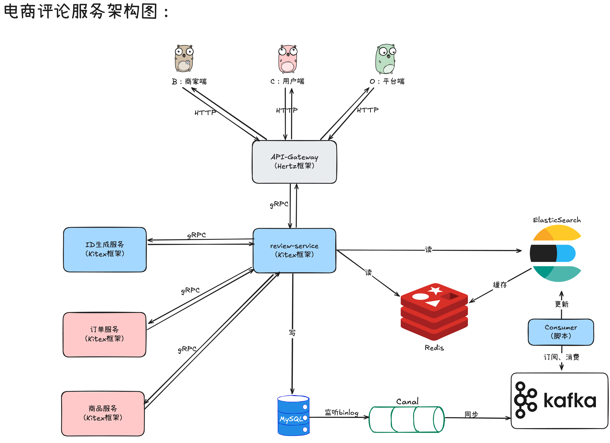
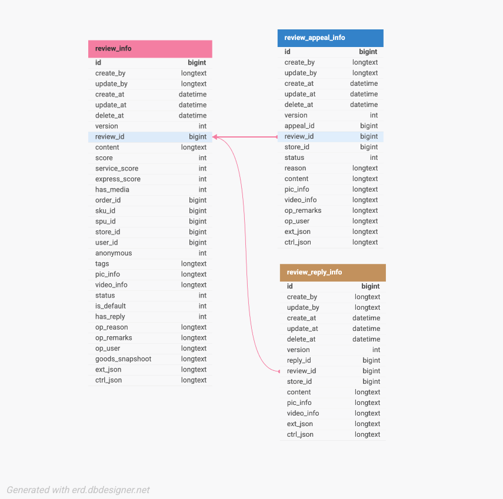

# 项目简介

本项目是一个使用Go语言编写的电商评价服务。

---

业务上包含C端（用户端）、B端（商家端）以及O端（平台端），其中：
- C端：创建评价、查看评价
- B端：查看评价、回复评价、投诉评价、查看投诉
- O端：查看申诉、处理投诉、查看评价、审核评价

---

技术上考虑到电商的评论系统属于「读多写少」的场景，采用CQRS架构：
- **写链路**：MySQL
- **读链路**：ElasticSearch + Redis
- **数据同步**：Canal + Kafka + 消费者脚本

---

本仓库由2个服务+1个API网关组成，均采用字节的CloudWeGo框架实现，分别是：
- **API网关（Hertz）**：暴露HTTP接口给C端、B端、O端用户。
- **评论服务（Kitex）**：暴露gRPC接口，提供核心评论读写能力。
- **唯一ID生成服务（Kitex）**：生成分布式趋势递增唯一ID。

# 架构图



# API概览

C端：

| 接口描述 | 方法 | 请求路径 | 解释 |
| --- | --- | --- | --- |
| 创建评价 | POST | /v1/review | 用户发表评价 |
| 获取商品评价 | GET | /v1/spu/{spu_id}/reviews | 根据SPU_ID查询评价列表（只显示status=20的评价） |

B端（商家后台）：

| 接口描述 | 方法 | 请求路径 | 解释 |
| --- | --- | --- | --- |
| 回复评价 | POST | /v1/review/reply | 回复评价 |
| 申诉评价 | POST | /v1/review/appeal | 申诉评价 |
| 查看投诉 | GET | /v1/store/{store_id}/appeals | 浏览当前storeID发布的所有投诉 |
| 查看评价 | GET | /v1/store/{store_id}/reviews | 根据店铺ID查询评价列表 |
| 获取商品评价 | GET | /v1/spu/{spu_id}/reviews | 根据SPU_ID查询评价列表 |

O端：

| 接口描述 | 方法 | 请求路径 | 解释 |
| --- | --- | --- | --- |
| 审核申诉 | POST | /v1/appeal/audit | 修改申诉的状态 |
| 查看申诉 | GET | /v1/status/{status}/appeals | 根据申诉状态查看的申诉 |
| 审核评价 | POST | /v1/reviews/audit | 修改评价状态 |
| 查看评价 | GET | /v1/status/{status}/reviews | 根据评价状态查看的评价 |


# 数据库表设计

这张图是用dbdesigner做的：https://www.dbdesigner.net/



字段详细解释：

```go
// ReviewAppealInfo 评论申诉表
type ReviewAppealInfo struct {
	ID        int64      // 主键
	CreateBy  string     // 创建方标识
	UpdateBy  string     // 更新方标识
	CreateAt  time.Time  // 创建时间
	UpdateAt  time.Time  // 更新时间
	DeleteAt  *time.Time // 逻辑删除标记
	Version   int32      // 乐观锁标记
	ExtJSON   string     // 信息扩展
	CtrlJSON  string     // 控制扩展

	AppealID  int64      // 申诉id
	ReviewID  int64      // 评价id
	StoreID   int64      // 店铺id
	Status    int32      // 状态:10待审核；20申诉通过；30申诉驳回
	Reason    string     // 申诉原因类别
	Content   string     // 申诉内容描述
	PicInfo   string     // 媒体信息：图片
	VideoInfo string     // 媒体信息：视频
	OpRemarks string     // 运营备注
	OpUser    string     // 运营者标识
}
```

```go
// ReviewInfo 评价表
type ReviewInfo struct {
	ID             int64      // 主键
	CreateBy       string     // 创建方标识
	UpdateBy       string     // 更新方标识
	CreateAt       time.Time  // 创建时间
	UpdateAt       time.Time  // 更新时间
	DeleteAt       *time.Time // 逻辑删除标记
	Version        int32      // 乐观锁标记
	ExtJSON        string     // 信息扩展
	CtrlJSON       string     // 控制扩展    

	ReviewID       int64      // 评价id
	Content        string     // 评价内容
	Score          int32      // 评分
	ServiceScore   int32      // 商家服务评分
	ExpressScore   int32      // 物流评分
	HasMedia       int32      // 是否有图或视频
	OrderID        int64      // 订单id
	SkuID          int64      // sku id
	SpuID          int64      // spu id
	StoreID        int64      // 店铺id
	UserID         int64      // 用户id
	Anonymous      int32      // 是否匿名
	Tags           string     // 标签json
	PicInfo        string     // 媒体信息：图片
	VideoInfo      string     // 媒体信息：视频
	Status         int32      // 状态:10待审核；20审核通过；30审核不通过；40隐藏
	IsDefault      int32      // 是否默认评价
	HasReply       int32      // 是否有商家回复:0无;1有
	OpReason       string     // 运营审核拒绝原因
	OpRemarks      string     // 运营备注
	OpUser         string     // 运营者标识
	GoodsSnapshoot string     // 商品快照信息
}
```

```go
type ReviewReplyInfo struct {
	ID        int64      // 主键
	CreateBy  string     // 创建方标识
	UpdateBy  string     // 更新方标识
	CreateAt  time.Time  // 创建时间
	UpdateAt  time.Time  // 更新时间
	DeleteAt  *time.Time // 逻辑删除标记
	Version   int32      // 乐观锁标记
	ExtJSON   string     // 信息扩展
	CtrlJSON  string     // 控制扩展

	ReplyID   int64      // 回复id
	ReviewID  int64      // 评价id
	StoreID   int64      // 店铺id
	Content   string     // 评价内容
	PicInfo   string     // 媒体信息：图片
	VideoInfo string     // 媒体信息：视频
}
```

# 参考

参考了七米老师的项目思路，但是完全使用字节开源的：Kitex + Hertz框架实现（而不是教程中的B站开源的：Kratos框架）。

- 七米老师原项目地址：[七米老师github](https://github.com/Q1mi/go-micro-service-and-cloud-native-course/tree/master/lesson115/review-service)
- 字节CloudWeGo官网：[字节CloudWeGo](https://cloudwego.cn/zh/)
- 字节官网项目地址：[字节微服务项目Demo](https://github.com/cloudwego/biz-demo)

## ES

- 查找流程 & 插入流程：[ES的查找与插入笔记](./blog/es.md)