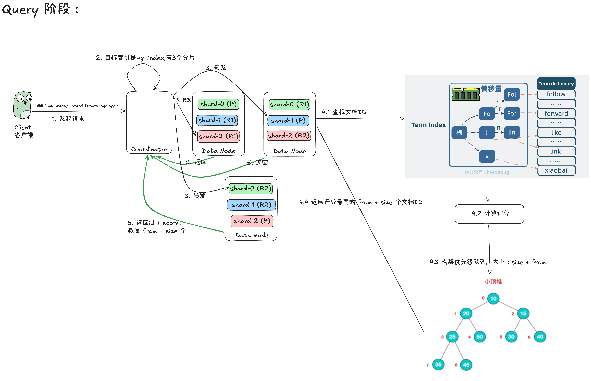
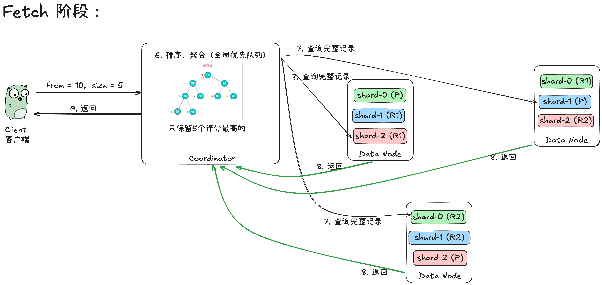
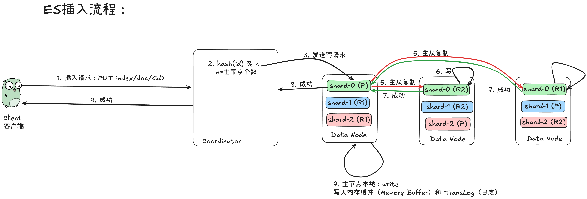

# 1. ES 的查找流程

参考了：
- https://golangguide.top/%E4%B8%AD%E9%97%B4%E4%BB%B6/es/%E6%A0%B8%E5%BF%83%E7%9F%A5%E8%AF%86%E7%82%B9/elasticSearch%E6%9E%B6%E6%9E%84%E6%98%AF%E6%80%8E%E4%B9%88%E6%A0%B7%E7%9A%84.html
- DeepSeek

## 1.1 文字描述

假设一个简单的集群：1个索引（`my_index`），该索引有3个主分片（P0, P1, P2）和每个主分片各有1个副本分片（R0, R1, R2）。集群共有多个节点。

### 1.1.1 第一阶段：查询阶段（Query Phase）

这个阶段的目的是**让所有相关分片并行地执行查询，找到匹配的文档，并生成一个优先级队列（存储的是`_id`和排序值`_score`）**，而不是返回完整的文档数据。

**步骤详解：**

1.  **客户端发起请求**：
    *   客户端（如 Kibana、Java 应用）发送一个搜索请求到一个 Elasticsearch 节点（此时该节点成为**协调节点**）。
    *   请求示例：`GET my_index/_search?q=message:apple`

2.  **协调节点解析与路由**：
    *   协调节点解析请求，确定需要搜索哪些索引和分片。
    *   在我们的例子中，目标索引是 `my_index`，它有 3 个主分片。
    *   **默认情况下，查询会广播到所有目标分片（主分片或其副本）**。协调节点会根据负载均衡策略，选择每个主分片的一个副本（可能是主分片本身，也可能是其副本分片）来执行操作。例如，它可能决定将请求发送到：`P0, R1, P2`。

3.  **向目标分片发送查询请求**：
    *   协调节点将搜索请求并行地转发到步骤2中选出的所有分片（P0, R1, P2）。

4.  **分片本地执行查询（在每个数据节点上）**：
    *   每个目标分片在**本地**独立执行完全相同的查询。
    *   **过程**：
        *   **解析查询**：解析查询字符串 `q=message:apple`。
        *   **查找倒排索引**：在分片本地的倒排索引中，查找 `message` 字段包含词条 `"apple"` 的所有文档ID（Doc ID）。
        *   **评分和排序**：根据 TF/IDF 或 BM25 等评分算法，为每个匹配的文档计算相关性得分 `_score`。
        *   **构建优先级队列**：分片会创建一个大小为 `from + size` 的本地优先级队列（Heap）。例如，如果请求是 `?size=10&from=0`，那么每个分片需要找出自己分片内**得分最高**的 10 个文档的 `_id` 和 `_score`。
        *   **可能还会执行聚合（Aggregation）操作**：如果查询包含了聚合语句，分片也会在本地执行聚合，生成初步的聚合结果。

5.  **分片返回结果给协调节点**：
    *   每个分片将其本地优先级队列中所有文档的 `_id` 和 `_score`（以及可能的聚合结果）返回给协调节点。
    *   **注意**：此时返回的**不是完整的文档源数据（`_source`）**，只是用于排序和排重的元信息。

至此，查询阶段结束。协调节点现在拥有了所有分片返回的“候选”文档列表。例如：
*   来自 P0 的 Top 10 `(_id, _score)` 对
*   来自 R1 的 Top 10 `(_id, _score)` 对
*   来自 P2 的 Top 10 `(_id, _score)` 对

---

### 1.1.2 第二阶段：取回阶段（Fetch Phase）

这个阶段的目的是**将查询阶段确定的、最终需要返回的文档的完整数据（`_source`）取回**。

**步骤详解：**

1.  **协调节点合并、排序全局结果**：
    *   协调节点接收到所有分片返回的 `(_id, _score)` 对。
    *   它将这些结果**合并到一个全局的优先级队列**中，并进行全局排序（如果使用自定义排序，则按自定义规则排序）。现在它知道了整个集群中得分最高的 `size` 个文档是哪些。
    *   它确定了最终需要返回给客户端的文档列表（比如前10个）。

2.  **协调节点向相关分片发起批量 `GET` 请求**：
    *   协调节点已经知道每个文档属于哪个分片（根据 `_id` 的哈希值决定）。
    *   它向**存有这些最终文档的分片**发送一个 **`multi-get`（`mget`）** 请求，请求中包含了需要获取的文档的 `_id`。

3.  **分片获取文档数据并返回**：
    *   各个分片接收到 `mget` 请求后，根据 `_id` 从本地的存储中加载每个文档的完整源数据（`_source` 字段）。
    *   然后将这些完整的文档数据返回给协调节点。

4.  **协调节点组装并返回最终结果**：
    *   协调节点收集所有分片返回的完整文档数据。
    *   它将所有数据组装成一个单一的 JSON 响应（包括 `took`, `hits`, `aggregations` 等）。
    *   最终，将这个响应返回给客户端。

## 图解

这两张图是我参考了小白debug和deepseek之后自己画的。

# 2. ES 的插入流程

## 2.1 文字描述

## 2.2 图解

外部流程：

节点内部流程：

