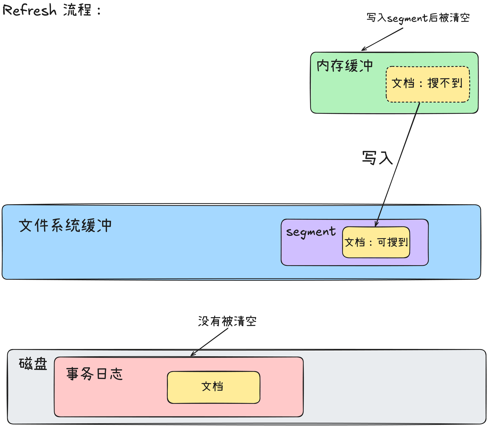
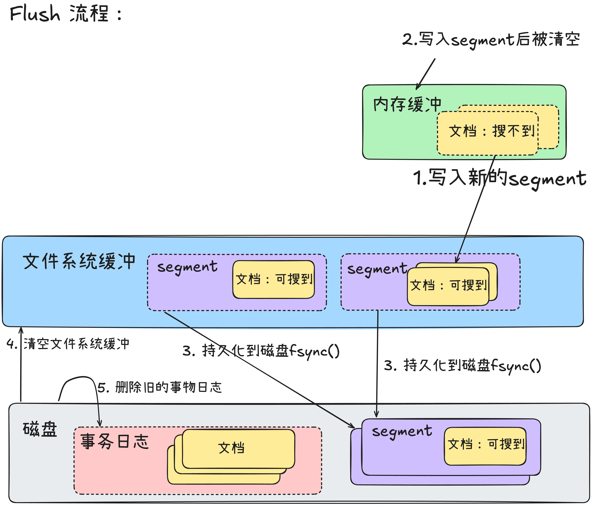

# 1. ES 的查找流程

参考了：
- [小白debug关于ES的博客](https://golangguide.top/%E4%B8%AD%E9%97%B4%E4%BB%B6/es/%E6%A0%B8%E5%BF%83%E7%9F%A5%E8%AF%86%E7%82%B9/elasticSearch%E6%9E%B6%E6%9E%84%E6%98%AF%E6%80%8E%E4%B9%88%E6%A0%B7%E7%9A%84.html)
- DeepSeek的回答

## 1.1 图解

这两张图是我参考了小白debug和deepseek之后自己画的。

## 1.2 文字描述

假设一个简单的集群：1个索引（`my_index`），该索引有3个主分片（P0, P1, P2）和每个主分片各有1个副本分片（R0, R1, R2）。集群共有多个节点。

### 1.2.1 第一阶段：查询阶段（Query Phase）

这个阶段的目的是**让所有相关分片并行地执行查询，找到匹配的文档，并生成一个优先级队列（存储的是`_id`和排序值`_score`）**，而不是返回完整的文档数据。

**步骤详解：**

1.  **客户端发起请求**：
    *   客户端（如 Kibana、Java 应用）发送一个搜索请求到一个 Elasticsearch 节点（此时该节点成为**协调节点**）。
    *   请求示例：`GET my_index/_search?q=message:apple`

2.  **协调节点解析与路由**：
    *   协调节点解析请求，确定需要搜索哪些索引和分片。
    *   在我们的例子中，目标索引是 `my_index`，它有 3 个主分片。
    *   **默认情况下，查询会广播到所有目标分片（主分片或其副本）**。协调节点会根据负载均衡策略，选择每个主分片的一个副本（可能是主分片本身，也可能是其副本分片）来执行操作。例如，它可能决定将请求发送到：`P0, R1, P2`。

3.  **向目标分片发送查询请求**：
    *   协调节点将搜索请求并行地转发到步骤2中选出的所有分片（P0, R1, P2）。

4.  **分片本地执行查询（在每个数据节点上）**：
    *   每个目标分片在**本地**独立执行完全相同的查询。
    *   **过程**：
        *   **解析查询**：解析查询字符串 `q=message:apple`。
        *   **查找倒排索引**：在分片本地的倒排索引中，查找 `message` 字段包含词条 `"apple"` 的所有文档ID（Doc ID）。
        *   **评分和排序**：根据 TF/IDF 或 BM25 等评分算法，为每个匹配的文档计算相关性得分 `_score`。
        *   **构建优先级队列**：分片会创建一个大小为 `from + size` 的本地优先级队列（Heap）。例如，如果请求是 `?size=10&from=0`，那么每个分片需要找出自己分片内**得分最高**的 10 个文档的 `_id` 和 `_score`。
        *   **可能还会执行聚合（Aggregation）操作**：如果查询包含了聚合语句，分片也会在本地执行聚合，生成初步的聚合结果。

5.  **分片返回结果给协调节点**：
    *   每个分片将其本地优先级队列中所有文档的 `_id` 和 `_score`（以及可能的聚合结果）返回给协调节点。
    *   **注意**：此时返回的**不是完整的文档源数据（`_source`）**，只是用于排序和排重的元信息。

至此，查询阶段结束。协调节点现在拥有了所有分片返回的“候选”文档列表。例如：
*   来自 P0 的 Top 10 `(_id, _score)` 对
*   来自 R1 的 Top 10 `(_id, _score)` 对
*   来自 P2 的 Top 10 `(_id, _score)` 对

---

### 1.2.2 第二阶段：取回阶段（Fetch Phase）

这个阶段的目的是**将查询阶段确定的、最终需要返回的文档的完整数据（`_source`）取回**。

**步骤详解：**

1.  **协调节点合并、排序全局结果**：
    *   协调节点接收到所有分片返回的 `(_id, _score)` 对。
    *   它将这些结果**合并到一个全局的优先级队列**中，并进行全局排序（如果使用自定义排序，则按自定义规则排序）。现在它知道了整个集群中得分最高的 `size` 个文档是哪些。
    *   它确定了最终需要返回给客户端的文档列表（比如前10个）。

2.  **协调节点向相关分片发起批量 `GET` 请求**：
    *   协调节点已经知道每个文档属于哪个分片（根据 `_id` 的哈希值决定）。
    *   它向**存有这些最终文档的分片**发送一个 **`multi-get`（`mget`）** 请求，请求中包含了需要获取的文档的 `_id`。

3.  **分片获取文档数据并返回**：
    *   各个分片接收到 `mget` 请求后，根据 `_id` 从本地的存储中加载每个文档的完整源数据（`_source` 字段）。
    *   然后将这些完整的文档数据返回给协调节点。

4.  **协调节点组装并返回最终结果**：
    *   协调节点收集所有分片返回的完整文档数据。
    *   它将所有数据组装成一个单一的 JSON 响应（包括 `took`, `hits`, `aggregations` 等）。
    *   最终，将这个响应返回给客户端。

# 2. ES 的插入流程

参考了：
- [ES原理](https://pdai.tech/md/db/nosql-es/elasticsearch-y-th-3.html#%E5%8D%95%E4%B8%AA%E6%96%87%E6%A1%A3)
- DeepSeek

图是自己画的，文字是DeepSeek写的，用人类的blog做了验证。

## 2.1 图解

外部流程：

节点内部流程：

## 2.2 文字描述

假设一个集群：一个名为 `my_index` 的索引，其配置为 `3个主分片` 和 `1个副本分片`（即每个主分片都有一个副本）。集群中有多个节点。

### 2.2.1 文档插入流程(外部)

插入一个新文档 `POST my_index/_doc/1` （ID为1）的完整流程如下：

#### 第1步：客户端请求到达协调节点

*   客户端向Elasticsearch集群中的**任何一个节点**发送HTTP PUT或POST请求。这个节点随即成为本次请求的**协调节点**。
*   请求体中包含要写入的JSON文档内容。

#### 第2步：协调节点路由与确定目标分片

*   协调节点解析请求，根据文档的 `_id` 和索引的配置，决定这个文档应该被存储在哪个**主分片**上。
*   **路由算法**：默认情况下，路由公式是 `shard_num = hash(_id) % number_of_primary_shards`。这意味着对于同一个 `_id`，每次计算都会得到同一个主分片编号。
    *   这也解释了为什么主分片的数量一旦确定就不能更改，否则所有文档的路由都会失效，无法找到。
*   在我们的例子中，协调节点通过计算 `hash("1") % 3`，确定文档 `_id=1` 应该被路由到主分片 `P0`（假设计算结果为0）。

#### 第3步：协调节点将请求转发到主分片所在节点

*   协调节点查看集群状态（Cluster State），知道主分片 `P0` 当前位于哪个数据节点上（例如，它在 `Node 1` 上）。
*   协调节点将索引请求内部转发到 `Node 1`。

#### 第4步：主分片本地写入

*   `Node 1` 上的主分片 `P0` 开始执行本地写入操作。这个过程是：
    1.  **验证**：检查文档结构是否符合映射（Mapping）规则。
    2.  **处理**：运行任何配置的** ingest pipeline **（如日期解析、字段重命名等）。
    3.  **索引内容**：将文档内容转换为Lucene所需要的格式，并写入到**事务日志（Translog）** 和**内存缓冲区（In-Memory Buffer）** 中。
        *   **事务日志（Translog）**：这是一个在磁盘上的追加写入（append-only）日志。每次写操作都会直接写入Translog。**它的核心目的是保证数据不会丢失**。即使节点突然断电，重启后也能通过重放Translog来恢复尚未持久化的数据。
        *   **内存缓冲区（In-Memory Buffer）**：文档同时会被加入到内存中的缓冲区。此时，文档还**不能被搜索到**。

    *此时，主分片可以认为写入操作初步成功，并准备进行下一步。*

#### 第5步：主分片并行复制到副本分片

*   主分片 `P0` 不会立即返回成功给协调节点。根据索引配置的 `副本数` 和请求的 `一致性级别`，它需要将写入操作复制到其所有**副本分片**（例如，`R0` 在 `Node 2` 上）。
*   主分片 `P0` 将完全相同的索引请求并行地转发到所有副本分片所在的节点（`Node 2`）。
*   每个副本分片（`R0`）在本地重复**第4步**的流程：将数据写入自己的Translog和内存缓冲区。
*   一旦**所有要求的副本分片**都成功执行了写入操作并报告给主分片，主分片才认为写入操作在分片级别是安全的。

> **重要**：写操作默认是**同步的**。主分片需要等待所有副本分片的响应。这是为了保证数据冗余的一致性。如果某个副本分片写入失败，主分片会向协调节点报告失败，整个写入请求会被标记为失败（尽管数据可能已写入主分片）。

#### 第6步：主分片响应协调节点

*   在主分片 `P0` 本身和所有必需的副本分片（`R0`）都成功将数据写入Translog和内存缓冲区后，主分片 `P0` 会向协调节点发送一个成功响应。

#### 第7步：协调节点响应客户端

*   协调节点接收到主分片 `P0` 的成功响应后，向客户端返回一个 `201 Created` 的HTTP响应，表示文档已成功写入。

---

### 2.2.2 后续后台过程：Refresh 和 Flush

此时，虽然客户端收到了成功响应，但数据还只在**Translog**和**内存缓冲区**中，并未被写入到Lucene的不可变段文件中，也**还不能被搜索到**。接下来的两个后台过程负责让数据变得可搜索并最终持久化。

#### 2.2.2.1. Refresh（刷新）

*   **触发**：默认每1秒自动发生一次，也可手动触发。这是一个相对轻量的操作。
*   **动作**：将内存缓冲区（In-Memory Buffer）中的所有文档清空，并创建一个新的**Lucene段（Segment）**。
*   **结果**：
    *   这个新的段首先被写入**文件系统缓存**（OS Cache），**此时数据还没有物理写入磁盘**。
    *   但这个新段被打开，使得其中的文档**变得可被搜索**。这就是Elasticsearch **近实时（NRT, Near Real-Time）** 搜索的原因：数据在写入后约1秒即可被搜索到，而不需要执行代价高昂的fsync操作。
*   **代价**：频繁的Refresh会产生大量小段（Segment），后续的段合并（Merge）过程会有一定的开销。

#### 2.2.2.2. Flush（刷盘）

*   **触发**：默认每30分钟一次，或者当Translog的大小达到一定阈值时自动触发。这是一个重量级操作。
*   **动作**：
    1.  触发一次Refresh，将内存缓冲区中的所有内容都生成一个新的段。
    2.  调用 `fsync()`，将文件系统缓存中所有**尚未持久化**的段（Segments）**强制刷到磁盘**上，实现物理持久化。
    3.  清空（Truncate）事务日志（Translog），因为所有数据已经安全地保存在磁盘上了。一个新的Translog会被创建。
*   **结果**：确保所有数据被物理写入磁盘，实现了真正的持久化，同时清理了旧的Translog。
