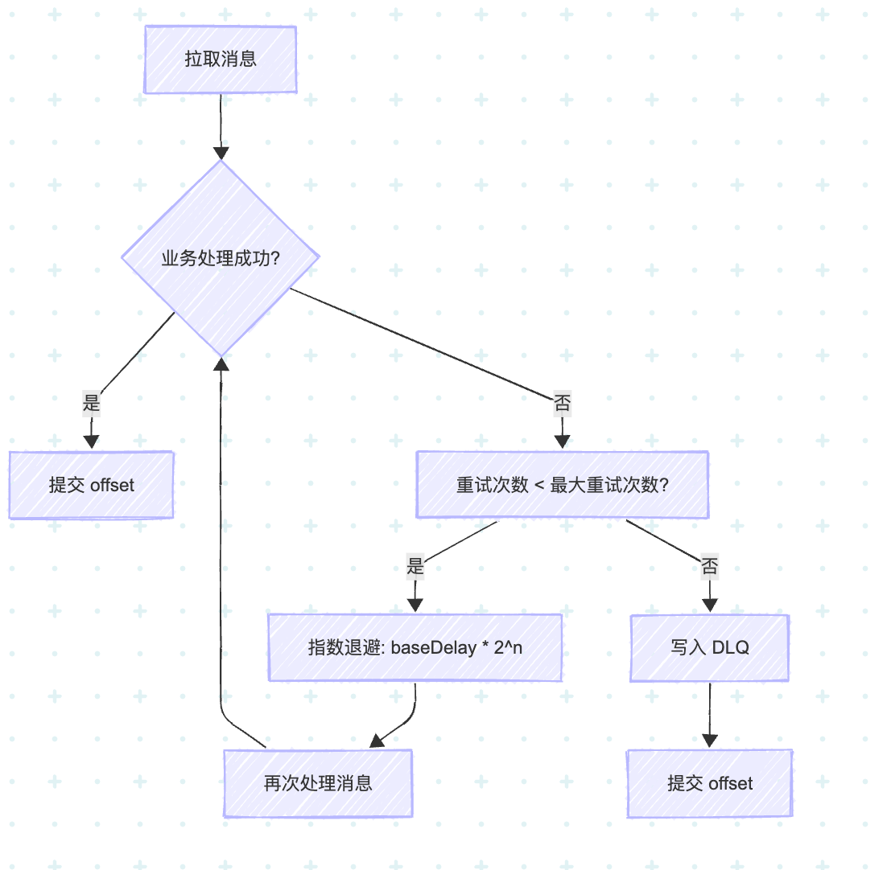
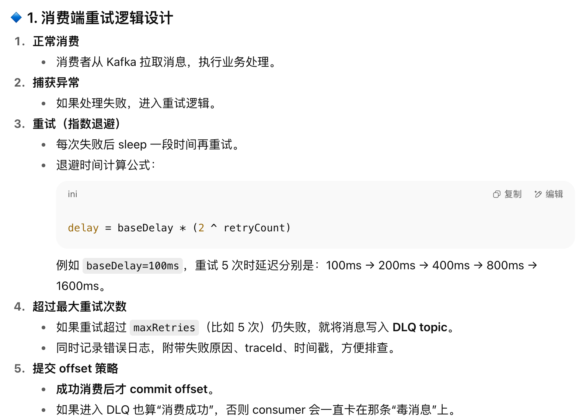
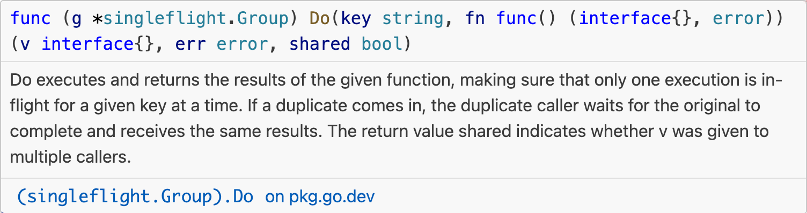

# 项目拷打

1. 为什么这样设计（CQRS）？

- > 答2个点，一个是电商的评论系统属于读多写少的系统，把读写分离开，可以降低MySQL的压力。第二是O端有根据各种评论字段查询评论和申诉的需求，如果使用MySQL，需要在很多字段上都建索引，索引的开销较大，而ES更适合复合条件查询的场景，用ES更能满足O端运营同学需求。

2. 你是怎么设计评价的状态流转的？

- > 答：先发后审。评论的状态是10（待审核）、20（已审核）、30（已拒绝）。待审核和已审核的评价都能被显示。只有已拒绝的评价不会被显示。

3. 如何保障canal->kafka->es的消息不丢失？

- > 答：生产者端：canal -> kakfa 默认它是同步的，消息会被可靠地发送到Kafka。
- > broker端：开启持久化机制。
- > 消费者端：1. 关闭自动提交，采用手动提交offset，确保消息被消费后再提交offset。2. 消费者端开启重试机制，当消费失败时，会自动重试。重试采用指数退避。超过一定重试次数，则写入Kafka的另外一个Topic（模拟死信队列）。3.有重试就一定需要做幂等。

重试方案详细：





幂等方案详细：

写ES时用review_id作为doc_id，确保幂等。

```
PUT /review/_doc/{review_id}
{
  "review_id": 123,
  "content": "不错的商品",
  "score": 5
}
```
4. 什么是缓存击穿？

- > 答：缓存击穿是指一个key非常热点，在缓存中被缓存了，但是在数据库中没有这个key，导致缓存失效，所有请求都打到数据库上，数据库压力增大。

5. singleflight 为什么能解决缓存击穿问题？ 
 
- > 答：singleflight 提供了在并发场景下多个函数只有一个真正执行，其他函数共享其执行结果的能力。



6. 压测过吗？

- > 答：压测过。但考虑到双11大促早上10点和下午5点有活动，两个峰值时间点实时在线人数接近1w，我们压测按这个流量的2.5倍来压，也就是2.5w QPS。

7. 为什么需要分布式唯一ID？

- > 美团的文章：https://tech.meituan.com/2017/04/21/mt-leaf.html。

8. 如何判断是否发生了时钟回拨问题？

- > 答：通过记录上一次使用的TimeStamp。

9. 时钟回拨问题解决？

- > 答：设置一个时间阈值，小于阈值，则阻塞等待，直到时间追上。超过阈值，直接返回错误。


10. 为什么会发生时钟回拨？

- > NTP（Network Time Protocol）校准。分布式服务器通常通过 NTP 与标准时间源同步。如果本地时间比标准时间快，NTP 会把时间往回调，造成回拨。

11. 借机会问Kafka八股文。
12. 借机会问ES八股文。

